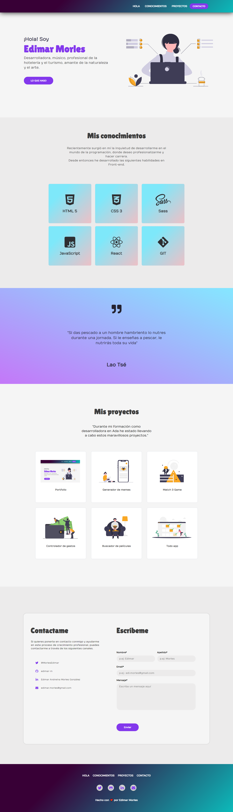

# Portafolio de Ada
  ### Este proyecto está realizado para mostrar un ejemplo de como sería un portafolio para la entrega final del módulo-01 de Ada.

  ### Si quieres ver como me quedó puedes dar click en el siguiente [enlace](https://edimar-m.github.io/Portfolio-modulo-1/) o puedes hacerlo desde [acá]()

   

  ***

  ### Si quieres tener el código en tu computadore deberás seguir los siguientes pasos en tu terminal.

  - Ir al [repositorio](https://edimar-m.github.io/Portfolio-modulo-1/)

  - darle click al botón de forkear
  - darle click al botón de code
  - copiar la URL
   - Abrir tu terminal y poner el comando de **git clone <url>**
  - Entrar a la carpeta del proyecto y abrirlo en tu IDE

### Este proyecto no necesita la instalación de ninguna dependencia, por ahora!

***

### Este debería ser el resultado final de tu instalación

***

### Este portafolio fue desarrollado para las chicas de la cursada 6 online de ADA, Agradezco a [Leidy] (https://github.com/leydyk93/
) por toda su ayuda!

 

***
### De Edimar Con 🧡 para ustedes!
  
